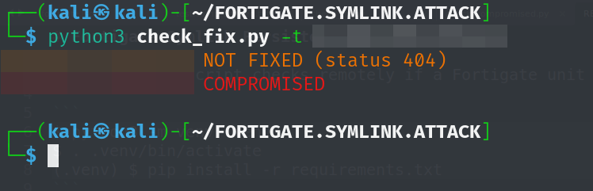

# Fortigate Symlink Persistence Method Checker

The following script checks remotely if a Fortigate unit has been fixed vs the persistence method leveraging a symlink in the VPN-SSL used by TA

```
$ python3 -m venv .venv
$ . .venv/bin/activate
(.venv) $ pip install -r requirements.txt
```

# Usage

```
$ python3 check_fix.py -h
usage: check_fix.py [-h] (-j JSON_FILE | -t TARGET | -i IP_FILE) [--check]

Check FIXED/NOT FIXED status and optionally compromised state on devices.

options:
  -h, --help            show this help message and exit
  -j, --json-file JSON_FILE
                        Path to SHODAN JSON file of devices
  -t, --target TARGET   Single IP:port
  -i, --ip-file IP_FILE
                        Text file with IP:port per line
  --check               If specified, skip the sys_global.conf.gz compromised check
```

# Examples

```
(.venv) $ python3 check_fix.py -j ../Fortigates.Shodan/fortigate.json
(.venv) $ python3 check_fix.py -t IP.IP.IP.IP:10443
```

